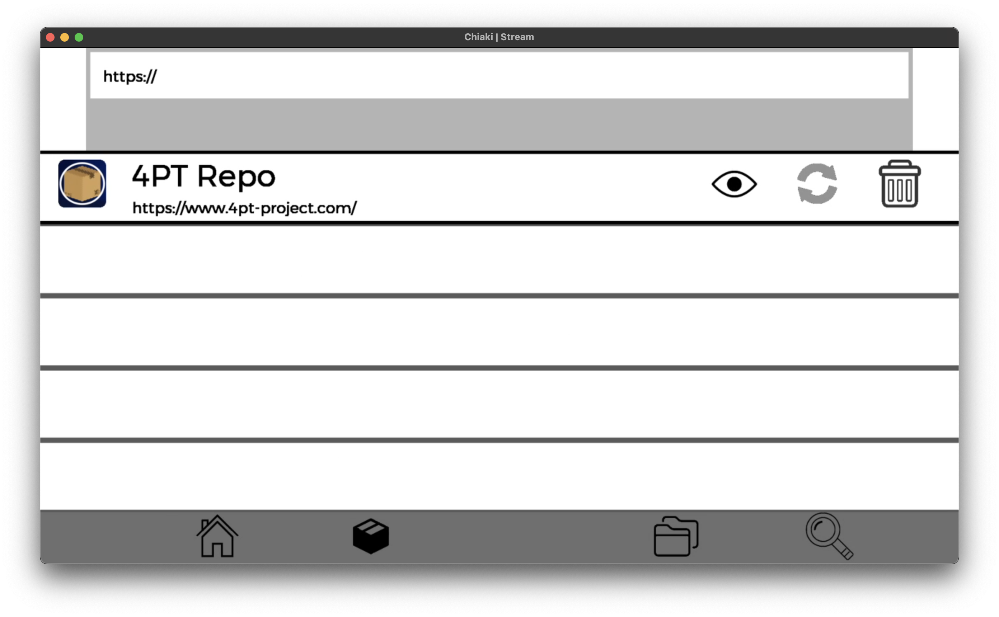
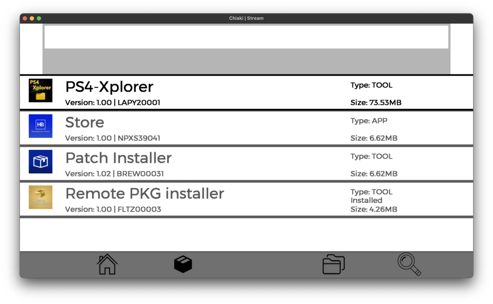

<div id="top"></div>

<h1 align="center">4PT Repository</h1>

<div align="center">
  
  
</div>


<!-- TABLE OF CONTENTS -->
<details>
  <summary>Table of Contents</summary>
  <ol>
    <li>
      <a href="#wit">What is this?</a>
    </li>
    <li><a href="#usage">Usage</a>
    <ul>
    <li><a href="#repoName">Repository Name</a></li>
    <li><a href="#repoIcon">Repository Icon</a></li>
    <li><a href="#pkg">Adding Packages</a></li>
    </ul></li>
  </ol>
</details>

<div id="wit"></div>

## What is this?

This is a template for a repository for the <a href="https://github.com/victorrjimenezz/PS4-4PT">4PT: PS4 APT</a>.</br>
This template includes 4 Homebrew Apps: </br>
* PS4-Xplorer (By <a href="https://twitter.com/lapy05575948">@lapy05575948</a>)
* Homebrew Store (By <a href="https://twitter.com/lightningmods_">@lightningmods_</a>)
* PS4 Patch Installer (By <a href="https://twitter.com/0x199">@0x199</a>)
* Remote Package Installer (By <a href="https://twitter.com/flat_z">@flat_z</a>)
<p align="right">(<a href="#top">back to top</a>)</p>

******
<div id="usage"></div>

## Usage
The repository information is stored in a file called repo.yml, located in the root folder of the 
repository. ***(DISCLAMER: YML IS TAB AND LINE BREAK SENSITIVE, SO BE SURE TO WRITE EVERYTHING AS DESCRIBED)***

<div id="repoName"></div>

### Repository Name (Necessary)
To set the repository name, change the field: </br>
`name: 4PT Repo` </br>
to whatever name you want to set.

<div id="repoIcon"></div>

### Repository Icon (Optional)
To set the repository icon, change the field: </br>
`iconPath: icon.png` </br>
to the desired icon path.

The image has to be a: </br>
PNG, JPEG, JPG, TGA, BMP OR NON-ANIMATED ***(FOR NOW)*** GIF </br>

***(NOTE: THE ICON CAN BE ANY SIZE AND SHAPE, BUT IT IS RECOMMENDED THAT IT IS
A SQUARE IMAGE)***

If a valid icon is not found, 4PT will switch to the default repository icon.

<div id="pkg"></div>

### Adding Packages
To add a package, the following block of text is required
```
PACKAGE_NAME:
  pkgPath: PACKAGE_PATH
  type: PACKAGE_TYPE
```

where each parameter should be replaced by the desired parameter. </br></br>
```PACKAGE_TYPE``` should be replaced by:
- *GAME*
- *APP*
- *UPDATE*
- *THEME*
- *TOOL*
- *CHEAT*
- *MISC*

If ```PACKAGE_TYPE``` is none of the above, app reads it as *MISC*

***
NOTES: </br>

- Do not include spaces in the ```PACKAGE_PATH```</br>
- Package names CAN be repeated. </br>
- Make a line break at the end of the text block.
***